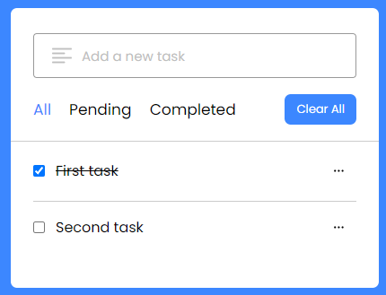
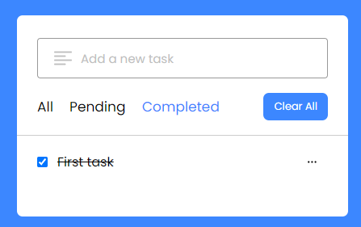

# TODO-list 

## Welcome! 👋

This is a todo-list web, in this you will be able to save your different ideas, or any task (despite reloading the page) and mark them in case you have completed it, in addition to having a filter for completed and uncompleted tasks

## Links
* Live Site URL: [Todo-list](https://tubular-pixie-c3addc.netlify.app)

## My Process.

### Things i have learned.
I learned how to use **Local Storage** for save information and interact with this information.

### Built with
* Semantic HTML5 markup
* Css custom properties
* FLEXBOX
* SCSS
* JavaScript
* BEM Methodology
* Local Storage
